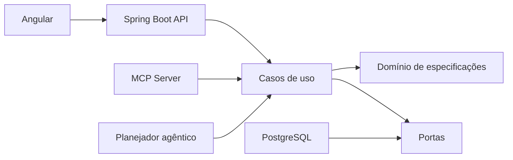

# Vertex SDD Hub

Uma mudança de software começa com uma necessidade, mas costuma chegar à release espalhada entre ticket, conversa, pull request e memória do time. O Vertex reúne a especificação, os critérios de aceite e as evidências de qualidade em um fluxo único.

Este é o terceiro projeto da série Projetos 2026 DEV. O objetivo é praticar Java com Spring Boot e Angular em um problema que também permite demonstrar Spec-Driven Development, agentes, MCP e automação de release.

## Estado atual

O primeiro incremento está sendo construído a partir da especificação em [`specs/001-vertex-sdd-hub/spec.md`](specs/001-vertex-sdd-hub/spec.md). A documentação será atualizada junto com o código.

## Arquitetura planejada

## Autor

Pedro Igor Campos Costa, Salvador, 2026.
