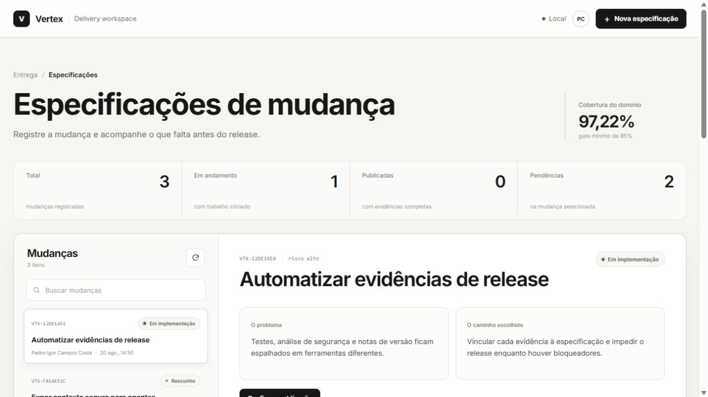
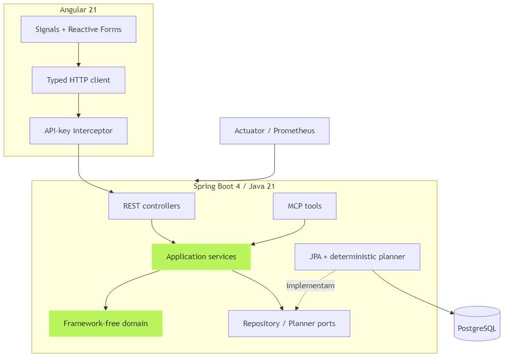

<div align="center">

# Vertex SDD Hub

**Uma decisão técnica só está pronta quando o time consegue explicar o problema, provar o comportamento e rastrear o release.**

[](backend/pom.xml)
[](backend/pom.xml)
[](frontend/package.json)
[](backend/src/test)
[](LICENSE)

</div>



## O problema que este projeto enfrenta

Em muitos times, a motivação da mudança fica no Jira, os critérios aparecem no pull request e as evidências terminam espalhadas entre pipeline, SonarQube e mensagens. Na hora do release, sobra uma pergunta simples e difícil de responder: **o que prova que esta entrega está pronta?**

O Vertex mantém esse fio. Cada mudança nasce como especificação, passa por revisão, vira trabalho rastreável e só pode ser publicada quando critérios e gates têm evidências. Quando algo falta, a API devolve os bloqueadores concretos.

## O que demonstra engenharia de verdade

- Domínio Java sem dependência de framework, protegido por teste arquitetural.
- API Spring Boot com validação, Problem Details, API key, CORS restrito e lock otimista.
- Persistência PostgreSQL versionada por Flyway.
- Angular com signals, Reactive Forms, cliente tipado e interface responsiva em paleta monocromática.
- Planner local determinístico: funciona sem custo externo e referencia todos os critérios.
- Servidor MCP com ferramentas somente leitura para uso seguro por agentes.
- Métricas Prometheus, health checks, SBOM CycloneDX, Checkstyle, SpotBugs e JaCoCo.
- Pipelines para GitHub Actions, GitLab CI e Jenkins, além de configuração SonarQube.
- ADRs, threat model, contrato OpenAPI, playbook de release e POC em formato acadêmico.

## Arquitetura



O backend usa portas e adaptadores. Os controladores REST e MCP chamam serviços de aplicação; as regras de transição e prontidão ficam no agregado `ChangeSpec`; JPA e o planner implementam portas externas. A interface não replica regras de release: ela apresenta o estado decidido pelo servidor.

No frontend, hierarquia e espaçamento fazem o trabalho que antes dependia de cores fortes e muitas bordas. Estados continuam legíveis em escala de cinza, os movimentos são curtos e a preferência `prefers-reduced-motion` é respeitada.

Veja também o [contexto do sistema](docs/assets/system-context.png), o [ciclo da especificação](docs/assets/spec-lifecycle.png) e a [sequência de release](docs/assets/release-sequence.png).

## Fluxo principal

```text
DRAFT → IN_REVIEW → APPROVED → IMPLEMENTING → RELEASED
           ↘ DRAFT                    ↑
                              critérios + 5 gates
```

Os cinco gates são testes de backend, testes de frontend, qualidade, segurança e notas de release. Um gate aprovado sem referência de evidência é recusado pelo domínio.

## Rodar em dois comandos

Pré-requisito: Docker Desktop.

```bash
git clone https://github.com/pedroigor-dev/vertex-sdd-hub.git
cd vertex-sdd-hub
docker compose up --build
```

Abra `http://localhost:4200`. A chave local é `local-development-key` e existe apenas para desenvolvimento. Os serviços recebem configuração por variáveis de ambiente; não use essa chave fora da máquina local.

Para trabalhar sem containers:

```powershell
# terminal 1: PostgreSQL precisa estar disponível em localhost:5432
cd backend
./mvnw.cmd spring-boot:run

# terminal 2
cd frontend
npm ci
npm start
```

Se o Maven do Windows apontar para um JDK antigo, defina `JAVA_HOME` para uma instalação Java 21 no terminal atual.

## Evidências verificáveis

```powershell
cd backend
./mvnw.cmd verify       # 17 testes + arquitetura + cobertura + análise estática + SBOM

cd ../frontend
npm test -- --watch=false
npm run build           # bundle inicial: 252 KB bruto
```

A política de cobertura exige pelo menos 85% sobre domínio e serviços de aplicação. Na versão atual, essa área atingiu **97,22%**. Adaptadores, DTOs e configuração são excluídos desse número; isso está declarado no `pom.xml`, sem maquiar o escopo da métrica.

## SDD e desenvolvimento agêntico

A especificação inicial está em [`specs/001-vertex-sdd-hub/spec.md`](specs/001-vertex-sdd-hub/spec.md). O [`CLAUDE.md`](CLAUDE.md) obriga o agente a partir de um critério, consultar ADRs e produzir evidência. A skill [`spec-review`](.claude/skills/spec-review/SKILL.md) transforma a revisão em um procedimento repetível.

O MCP expõe três consultas: lista de specs, detalhe de uma spec e prontidão de release. A decisão de não oferecer escrita está documentada no [ADR-0003](docs/adr/0003-read-only-mcp-tools.md).

## Decisões e limites assumidos

- A autenticação por chave compartilhada é adequada à POC, não a um ambiente corporativo. O próximo passo é OIDC com papéis.
- As evidências são referências rastreáveis, mas ainda não têm assinatura criptográfica do provedor de CI.
- O planner é determinístico para tornar o comportamento testável. Um provedor de IA pode entrar depois, atrás da mesma porta, com avaliação e fallback.
- A integração com Jira está mapeada, mas não automatizada antes de validar o fluxo com um time real.

Esses limites também aparecem no [threat model](docs/security-threat-model.md) e no [playbook de release](docs/release-playbook.md).

## Documentação

- [POC em PDF](docs/poc/POC-Vertex-SDD-Hub.pdf)
- [POC editável em DOCX](docs/poc/POC-Vertex-SDD-Hub.docx)
- [Arquitetura](docs/architecture.md)
- [Contrato OpenAPI](docs/openapi.yaml)
- [Mapeamento Jira](docs/jira-workflow.md)
- [ADRs](docs/adr)

## Autor

**Pedro Igor Campos Costa** — Salvador, 2026.

Se você revisaria esse desenho de outro modo, abra uma issue com o trade-off. A melhor conversa sobre arquitetura começa quando as restrições estão à vista.
