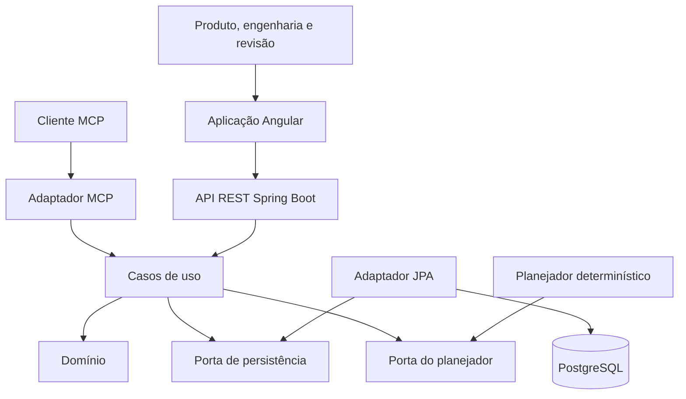
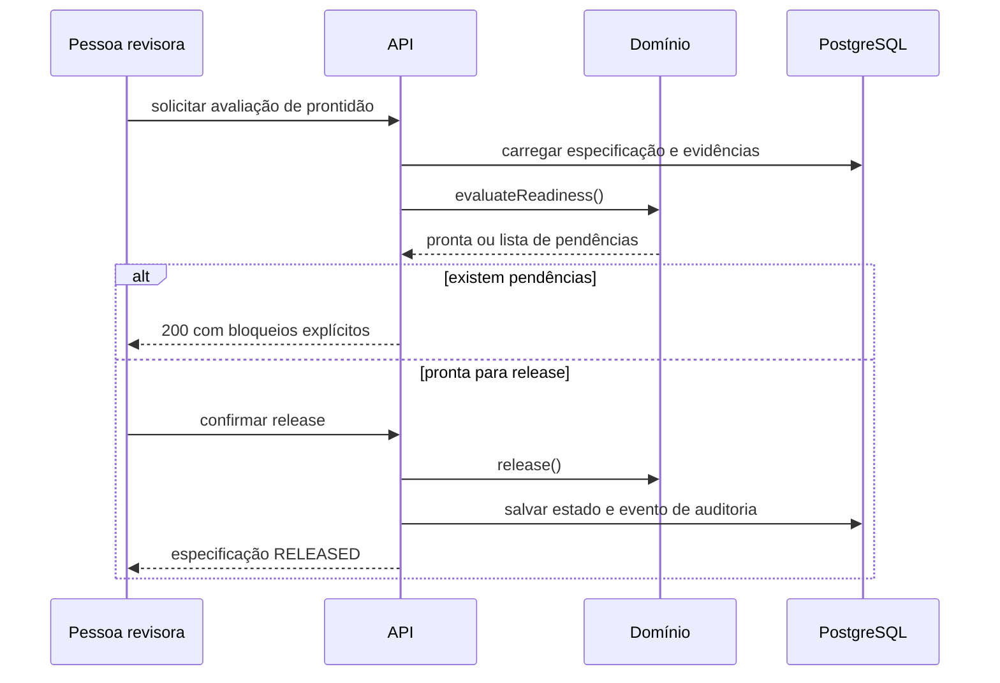

# Arquitetura e fluxos

## Limites

O backend adota portas e adaptadores. O domínio conhece especificações, critérios, gates e transições. Ele não conhece HTTP, JPA, PostgreSQL, MCP ou o planejador usado na borda.

O Angular consome a API por contratos tipados e mantém estado de tela com signals. Regras que protegem integridade continuam no backend; a interface apenas antecipa validações para melhorar a experiência.

## Visão de componentes

## Fluxo de release

## Decisões relacionadas

- [ADR 001: monorepo e limites hexagonais](adr/0001-monorepo-and-hexagonal-boundaries.md)
- [ADR 002: agente local antes de integração com LLM](adr/0002-local-planner-first.md)
- [ADR 003: ferramentas MCP somente leitura](adr/0003-read-only-mcp-tools.md)
